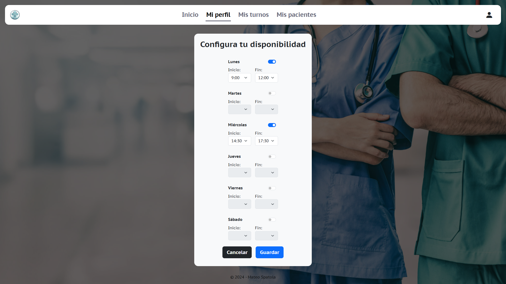

# Sistema de Gestión para Clínica Online (Trabajo Práctico)

#### Materia: Laboratorio de Computación IV
#### Alumno: Mateo Spatola

---

## 1. Descripción del Proyecto
Este sistema fue desarrollado para gestionar las operaciones de la Clínica Online, ofreciendo funcionalidades como el registro de usuarios, asignación de turnos, gestión de historias clínicas, y reportes. Está diseñado para facilitar la interacción entre pacientes, especialistas y administradores, promoviendo una experiencia de usuario eficiente e intuitiva.

**URL del sistema:** [https://spatolamateo-clinicaonline.web.app/](https://spatolamateo-clinicaonline.web.app/)  
**Alojamiento:** Firebase (incluye autenticación y base de datos).

---

## 2. Requerimientos del Sistema
El sistema incluye las siguientes funcionalidades:  
- **Registro y autenticación de usuarios:** Pacientes, especialistas y administradores.  
- **Gestión de turnos:** Solicitud, aceptación, cancelación, y finalización de turnos.  
- **Historias clínicas:** Creación, visualización y descarga de reportes en PDF.  
- **Administración:** Gestión de usuarios y turnos por parte de los administradores.  
- **Animaciones:** Transiciones fluidas entre componentes para mejorar la experiencia del usuario.

---

## 3. Funcionalidades por Sprint

### Sprint 1:
- Página de bienvenida con accesos a registro y login.  
- Registro diferenciado para pacientes y especialistas.  
- Login con validación de roles y estado de activación.  
- Gestión de usuarios para administradores, con permisos para habilitar o inhabilitar cuentas.  

### Sprint 2:
- Solicitud de turnos por especialidad, profesional y disponibilidad horaria.  
- Visualización de turnos con filtros avanzados para pacientes, especialistas y administradores.  
- Gestión de disponibilidad horaria por parte de los especialistas.  

### Sprint 3:
- Historias clínicas asociadas a cada paciente.  
- Descarga de reportes en PDF con logo, título y fecha.  
- Exportación de datos de usuarios a Excel por parte de administradores.  
- Mejoras en los filtros y animaciones de navegación.  

---

## 4. Modificaciones Realizadas

### Sprint 1:
- **Botones de acceso rápido** con imágenes de perfil de los usuarios.  
- **Registro simplificado** con botones iniciales que diferencian entre paciente y especialista.  

### Sprint 2:
- **Solicitud de turnos con botones visuales:**  
  - Especialidades como botones redondos con imágenes.  
  - Profesionales como botones redondos con nombres debajo.  
  - Fechas y horarios en formatos claros y rectangulares.  

### Sprint 3:
- **Visualización de pacientes atendidos** para especialistas, con acceso a detalles de turnos y reseñas.  
- **Exportación de datos en Excel** desde la sección de usuarios para administradores.  
- **Mejora de la sección "Mi Perfil"** para pacientes con descarga de historias clínicas en PDF.  
- **Animaciones de transición** entre componentes, como desplazamiento desde arriba hacia abajo.  

---

## 5. Guía de Usuario

### Página de inicio:
- Acceso al sistema mediante botones de login o registro.  
- Botones de acceso rápido para usuarios registrados (3 pacientes, 2 especialistas, 1 administrador).  

### Registro:
- Selección inicial entre paciente o especialista.  
- Formularios adaptados a cada rol, con validación de campos y reCAPTCHA.  

### Gestión de Turnos:
- Solicitar un turno:  
  1. Seleccionar especialidad (botones redondos).  
  2. Elegir profesional (botones redondos con nombres).  
  3. Seleccionar día y horario (botones rectangulares).  
- Visualización de turnos según el rol del usuario (paciente, especialista o administrador).  

### Historias Clínicas:
- Acceso desde el perfil del paciente o la sección de usuarios para administradores.  
- Creación y edición de historias clínicas por parte de los especialistas.  
- Descarga en PDF para pacientes.  

### Administración:
- Gestión de usuarios con exportación de datos a Excel.  
- Control total sobre las cuentas de usuarios y turnos de la clínica.  

---

## 6. Imágenes Representativas

### **Inicio**
  
Pantalla inicial del sistema.

  
Pantalla inicial del sistema (estando logueado).

### **Ingreso de Usuarios**
  
Formulario de ingreso al sistema.

  
Acceso rápido.

### **Registro de Usuarios**
  
Página de registro.

  
Formulario de registro para pacientes.

  
Formulario de registro para especialistas.

  
Formulario de registro para administradores (solo desde un admin).

### **Gestión de Turnos**
  
Pantalla para seleccionar especialidad al solicitar un turno desde un paciente.  

  
Pantalla para seleccionar paciente al solicitar un turno desde un administrador (1)

 
Pantalla para seleccionar paciente al solicitar un turno desde un administrador (2)

  
Pantalla para seleccionar paciente al solicitar un turno desde un administrador (3)

### **Listados**
  
Listado de turnos desde un administrador.

  
Listado de turnos solicitados por el paciente.

Listado de turnos del especialista. 

 
Listado de usuarios desde un administrador.

### **Historias Clínicas**
  
Visualización de la historia clínica de un paciente.

   
Visualización de la historia clínica de un especialista.

  
Informe en PDF de la historia clínica del paciente.

### **Otras imágenes**
-   
-   
-   
-   
-   
-   
-   
-   
-   
-   
-   
-   
-   
-   
-   
-   
